# AI Symptom Checker & Doctor Recommendation System - Architecture

This document provides a comprehensive technical guide to the AI-powered symptom analysis and doctor triage routing system integrated into the **VK Hospital Management System (MERN Stack)**.

---

## 1. Architectural Overview

The AI Checker is built using **LangChain Expression Language (LCEL)**, shifting away from direct API SDK integrations to a highly modular, decoupled, and fault-tolerant architecture. 

It acts as an intelligent medical triage assistant that:
1. Receives and analyzes patient symptoms.
2. Formats and validates the analysis structure via a strict JSON parser.
3. Automatically maps symptoms to one of the six active medical specialities configured in the hospital's MongoDB database.
4. Recommends corresponding, available medical specialists to the patient.

---

## 2. Technical Architecture & Data Flow

Below is the sequence of actions occurring during a symptom check request:

```mermaid
sequenceDiagram
    autonumber
    actor Patient as Patient (React Frontend)
    participant API as Express Router & Controller (Backend)
    participant Chain as LangChain Triage Chain (LCEL)
    participant Providers as Provider Factory
    participant DB as MongoDB (Doctor Collection)

    Patient->>API: POST /api/ai/analyze-symptoms { symptoms }
    Note over API: Validates & Sanitizes raw text input (minimum 5 chars)
    API->>Chain: runSymptomAnalysis(symptoms)
    
    rect rgb(25, 30, 45)
        Note over Chain, Providers: Multi-Tier Resiliency Loop
        Chain->>Providers: Get Primary Provider (OpenAI)
        alt OpenAI Success
            Providers-->>Chain: Returns parsed triage analysis
        else OpenAI Failure (Rate limit, missing keys, etc.)
            Chain->>Providers: Fallback to Secondary Provider (Gemini)
            Note over Providers: Attempts Gemini 1.5 Flash first
            alt Gemini 1.5 Flash 404s (Region/API retirement)
                Providers->>Providers: Fallback to Gemini 2.5 Flash
            end
            Providers-->>Chain: Returns parsed triage analysis
        end
    end

    Chain-->>API: Returns parsed Zod schema object
    Note over API: Case-insensitive speciality check and sanitization
    API->>DB: Query: find({ speciality: matchedSpeciality, available: true })
    DB-->>API: Returns available doctors (sensitive fields excluded)
    API-->>Patient: HTTP 200: { success: true, aiAnalysis, recommendedDoctors }
```



---

## 3. Directory and Module Structure

All AI-related logic is stored under the `backend/ai/` directory to ensure clean separation of concerns:

```text
backend/ai/
├── config/
│     └── aiConfig.js             # Parses .env parameters (active provider, models, temperature)
├── providers/
│     ├── openaiProvider.js       # Wrapper class for ChatOpenAI (gpt-4o-mini)
│     ├── geminiProvider.js       # Wrapper class for ChatGoogleGenerativeAI
│     └── providerFactory.js      # Factory pattern resolving models and cross-provider failovers
├── prompts/
│     └── symptomPrompt.js        # Formulates instructions and clinical safety guardrails
├── parsers/
│     └── symptomParser.js        # Establishes response schema using Zod
├── chains/
│     └── symptomAnalysisChain.js # Pipes prompt, model, and parser inside a RunnableSequence
└── utils/
      └── validateAIResponse.js   # Normalizes AI specialties to active MongoDB doctor specialties
```

---

## 4. Key Design Implementation Details

### A. Centralized Configuration (`aiConfig.js`)
Configured to pull dynamic variables from `.env`. Easily adjust settings globally:
```javascript
export const aiConfig = {
  provider: process.env.AI_PROVIDER || "openai",
  openai: {
    apiKey: process.env.OPENAI_API_KEY || "",
    model: process.env.OPENAI_MODEL || "gpt-4o-mini",
    temperature: 0.1
  },
  gemini: {
    apiKey: process.env.GEMINI_API_KEY || "",
    model: process.env.GEMINI_MODEL || "gemini-1.5-flash",
    temperature: 0.1
  }
};
```

### B. Dual-Tier Resiliency Loop (`symptomAnalysisChain.js`)
Designed to withstand API keys expiration, network latency, model retirements, or rate-limiting:
1. **Timeout Guard:** Employs a `15-second` execution ceiling using `Promise.race()`. If the active model hangs, the system terminates the promise and triggers failover.
2. **Provider Failover (OpenAI ⇄ Gemini):** If the primary provider (OpenAI) fails to run, the system automatically redirects the request to the fallback provider (Gemini).
3. **Model Fallback (Gemini 1.5 ⇄ Gemini 2.5):** If Gemini runs, it attempts to load `gemini-1.5-flash`. If that model throws a 404 error, it immediately falls back to `gemini-2.5-flash`.

### C. Zod Output Schema Parser (`symptomParser.js`)
Enforces formatting of the AI's output, bypassing common JSON structure issues:
```javascript
export const symptomParser = StructuredOutputParser.fromZodSchema(
  z.object({
    speciality: z.string().describe("Exactly one of: 'General physician', 'Gynecologist', 'Dermatologist', 'Pediatricians', 'Neurologist', 'Gastroenterologist'"),
    severity: z.enum(["low", "medium", "high"]),
    possible_conditions: z.array(z.string()),
    precautions: z.array(z.string()),
    emergency: z.boolean()
  })
);
```

### D. Medical Guardrails (`symptomPrompt.js`)
Prompts are designed to maintain strict legal and safety boundaries:
- **No Certitude:** Always describes conditions as potential topics of discussion with a doctor rather than concrete diagnoses.
- **No Prescriptions:** Instructed never to recommend specific medications or drug dosages.
- **Emergency Flag:** Configured to mark `emergency: true` only if critical warning signs (like chest pain or loss of consciousness) are present.

### E. MongoDB Speciality Normalization (`validateAIResponse.js`)
Performs a final post-processing step. Maps the parsed AI specialty output to the exact MongoDB doctor schema specialities:
* *General physician*
* *Gynecologist*
* *Dermatologist*
* *Pediatricians*
* *Neurologist*
* *Gastroenterologist*
*(Falls back gracefully to "General physician" if no match is found).*

---

## 5. Verification Command
To verify that the system is functioning correctly end-to-end, execute this terminal command:
```bash
curl -X POST -H "Content-Type: application/json" -d '{"symptoms":"I have a rash on my arm and it is very itchy"}' http://localhost:4000/api/ai/analyze-symptoms
```
