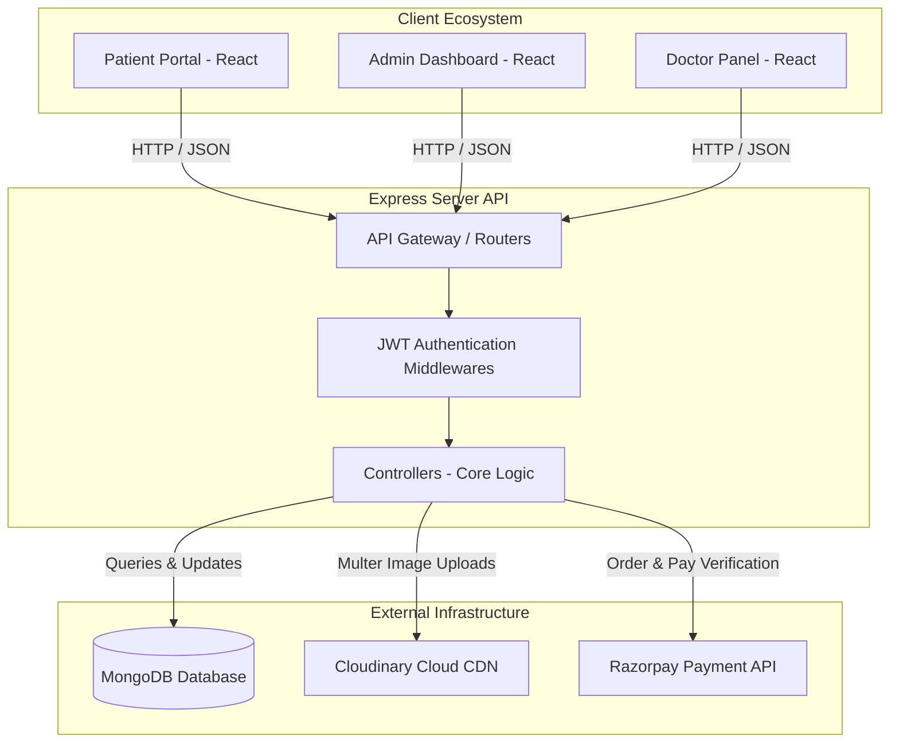
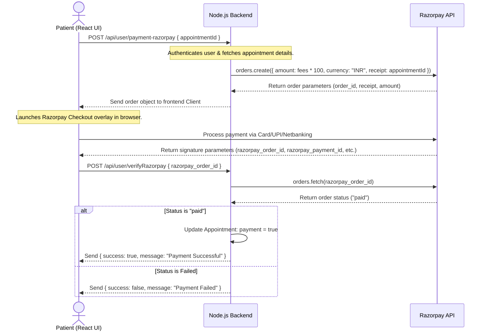
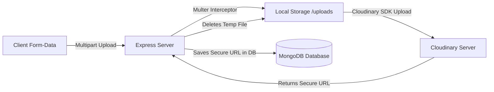
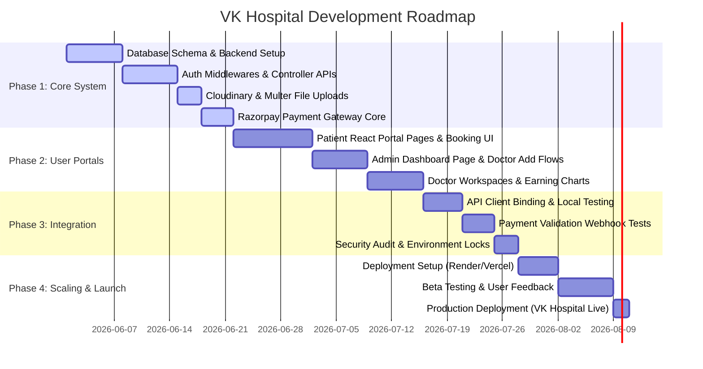

# VK Hospital: Comprehensive Technical Documentation & Roadmap

This document serves as an end-to-end technical guide for the **VK Hospital** project. It is structured to help both **business stakeholders (clients)** understand the operational workflows and **developers** understand the system architecture, database models, backend APIs, frontend states, and step-by-step setup guides.

---

## 1. Project Overview & Architecture

**VK Hospital** is a multi-portal healthcare management application designed to bridge the gap between patients, doctors, and administrative staff. It consists of three primary ecosystems:
1. **Patient Client Portal (Frontend)**: Allowed to search doctors by specialty, book slots, manage their profile, cancel/view appointments, and make online payments.
2. **Admin Panel**: Responsible for onboarding doctors, altering availability status, reviewing global appointment records, cancelling appointments, and viewing analytics.
3. **Doctor Panel**: Personalized workspace for onboarded doctors to track scheduled appointments, mark them as complete, cancel them, update their fees/address, and monitor individual earnings.

### Tech Stack
*   **Database**: MongoDB (via Mongoose ODM)
*   **Backend**: Node.js & Express (ES6 Modules), `google-auth-library`
*   **Frontend & Admin Panels**: React.js (built with Vite, styled with TailwindCSS, utilizing React Router Dom for SPA navigation, Axios for HTTP client operations, Google Identity Services SDK, and React Toastify for user feedback).
*   **Media Management**: Multer (local parsing) paired with Cloudinary (cloud asset storage).
*   **Payment Gateway**: Razorpay API Integration.

### High-Level Architecture Overview



---

## 2. Directory Structure

The project is structured in a clear, modular workspace dividing the backend API service, patient frontend, and admin/doctor dashboards.

```
VK_HOSPITAL/
├── backend/
│   ├── config/             # DB & CDN configuration (mongodb.js, cloudinary.js)
│   ├── controllers/        # Core business logic (adminController.js, doctorController.js, userController.js)
│   ├── middlewares/        # Authentication & Multer configs (authAdmin.js, authDoctor.js, authUser.js, multer.js)
│   ├── modules/            # Mongoose Schemas & Database Models (doctorModel.js, userModel.js, appointmentModel.js)
│   ├── routes/             # Express API Endpoints (adminRoute.js, doctorRoute.js, userRoute.js)
│   ├── server.js           # Express main server configuration
│   └── package.json        # Backend configuration & dependencies
│
├── frontend/               # Patient Client Portal (React + Vite + TailwindCSS)
│   ├── src/
│   │   ├── assets/         # Dynamic images, icons, and server-waking videos
│   │   ├── components/     # UI components (Navbar, Footer, TopDoctors, SpecialityMenu, etc.)
│   │   ├── context/        # AppContext.jsx for global state & API bindings
│   │   ├── pages/          # Patient views (Home, Doctors, Login, MyAppointments, MyProfile, etc.)
│   │   ├── App.jsx         # SPA routing & server wake-up/loading handlers
│   │   └── main.jsx        # DOM mounting
│   └── package.json
│
└── admin/                  # Admin & Doctor Management Panel (React + Vite + TailwindCSS)
    ├── src/
    │   ├── components/     # Global layout (Navbar, Sidebar)
    │   ├── context/        # Context APIs (AdminContext.jsx, DoctorContext.jsx)
    │   ├── pages/
    │   │   ├── Admin/      # Admin pages (Dashboard, AddDoctor, AllAppointments, DoctorsList)
    │   │   └── Doctor/     # Doctor pages (DoctorDashboard, DoctorAppointments, DoctorProfile)
    │   ├── App.jsx         # Routing for dashboard sub-views (conditional on auth tokens)
    │   └── main.jsx
    └── package.json
```

---

## 3. Database Models & Schema Design

Database collections are designed in MongoDB with validation structures to guarantee structural integrity.

### 3.1. Doctor Model (`doctorModel.js`)
Stores professional details, availability status, credentials, and booked time slots.
| Field | Type | Required | Description |
| :--- | :--- | :--- | :--- |
| `name` | String | Yes | Professional name of the doctor |
| `email` | String | Yes | Unique login email address |
| `password` | String | Yes | Hashed login password |
| `image` | String | Yes | Secure URL of doctor's profile image hosted on Cloudinary |
| `speciality` | String | Yes | Doctor's primary field (e.g., General Physician, Dermatologist, Pediatrician) |
| `degree` | String | Yes | Medical degrees (e.g., MBBS, MD) |
| `experience` | String | Yes | Number of years in practice (e.g., "5 Years") |
| `about` | String | Yes | Professional bio / description |
| `available` | Boolean | Default: `true` | General availability status for bookings |
| `fees` | Number | Yes | Consultation fee charged per appointment |
| `address` | Object | Yes | Serialized JSON containing street-level location |
| `date` | Number | Yes | UNIX timestamp representing registration date |
| `slots_booked`| Object | Default: `{}` | Tracks booked slot times organized by date keys (e.g., `{"2026-05-24": ["10:00 AM", "02:30 PM"]}`) |

### 3.2. User (Patient) Model (`userModel.js`)
Tracks patient registration credentials, profile photos, and essential health metadata.
| Field | Type | Required | Description |
| :--- | :--- | :--- | :--- |
| `name` | String | Yes | Account user's full name |
| `email` | String | Yes | Unique registration/login email |
| `password` | String | Yes | Hashed password |
| `image` | String | Default: Base64 | Account profile picture (defaults to a placeholder image) |
| `address` | Object | Default: `{}` | Home address details (separated into `line1` and `line2`) |
| `gender` | String | Default: "Not Selected" | Gender profile option |
| `dob` | String | Default: "Not Selected" | Date of birth |
| `phone` | String | Default: "000000000"| Contact phone number |

### 3.3. Appointment Model (`appointmentModel.js`)
Acts as the connection between Users and Doctors, tracking date, status, payment progress, and copy of snapshot records.
| Field | Type | Required | Description |
| :--- | :--- | :--- | :--- |
| `userId` | String | Yes | ID pointing to the patient who booked the slot |
| `docId` | String | Yes | ID pointing to the booked doctor |
| `slotDate` | String | Yes | Date string of the scheduled appointment (e.g. `24_05_2026`) |
| `slotTime` | String | Yes | Time slot booked (e.g. `10:00 AM`) |
| `userData` | Object | Yes | Snapshot of user fields when booking took place |
| `docData` | Object | Yes | Snapshot of doctor fields when booking took place (excluding booking schedule details) |
| `amount` | Number | Yes | Fees charged for this appointment |
| `date` | Number | Yes | UNIX timestamp when appointment record was created |
| `cancelled` | Boolean | Default: `false` | True if cancelled by either user, doctor, or administrator |
| `payment` | Boolean | Default: `false` | True if online payment completed successfully via Razorpay |
| `isComplete`| Boolean | Default: `false` | True if consultation is marked completed by the doctor |

---

## 4. Backend System Workings & API Reference

### 4.1. Core Middleware
1.  **Multer (`multer.js`)**: Configures disk storage options to temporarily hold uploaded profile images before transferring to Cloudinary.
2.  **User Authentication (`authUser.js`)**: Inspects headers for a valid `token`, decrypts user ID via JSON Web Token (JWT) verification, and appends `userId` to Request body.
3.  **Doctor Authentication (`authDoctor.js`)**: Checks headers for doctor-specific `dToken`, verifies authenticity, and appends `docId` to the request body.
4.  **Admin Authentication (`authAdmin.js`)**: Verifies request header contains `aToken`. Decrypts using server secret to confirm signature corresponds to admin credentials.

---

### 4.2. Express API Routes & Controllers

#### 4.2.1. Admin API (`/api/admin`)
Controls administration access, statistical counts, and doctor onboarding.
*   `POST /login`: Log in admin using predefined environmental credentials. Returns `token`.
*   `POST /add-doctor` **[Auth Required]**: Adds a doctor. Expects form-data including professional details and profile picture upload.
*   `POST /all-doctors` **[Auth Required]**: Returns lists of all onboarded doctors (excluding passwords).
*   `POST /change-availability` **[Auth Required]**: Toggles the availability flag of a doctor.
*   `GET /appointments` **[Auth Required]**: Returns all global appointments booked in the system.
*   `POST /cancel-appointment` **[Auth Required]**: Cancels any scheduled appointment and frees up the booked slot on the doctor's calendar.
*   `GET /dashboard` **[Auth Required]**: Serves dashboard metrics: counts of doctors, patients, total appointments, and list of the latest 5 appointments.

#### 4.2.2. Doctor API (`/api/doctor`)
Handles physician logs, schedules, and profile updates.
*   `GET /list`: Returns list of all doctors with basic details (excluding emails/passwords) for public search.
*   `POST /login`: Logs in doctor. Verifies credentials against database records and issues `token` with doctor's unique ID.
*   `GET /appointments` **[Auth Required]**: Retrieves list of all appointments scheduled under the logged-in doctor.
*   `POST /complete-appointment` **[Auth Required]**: Marks appointment complete.
*   `POST /cancel-appointment` **[Auth Required]**: Cancels appointment and releases time slot.
*   `GET /dashboard` **[Auth Required]**: Doctor statistics (total earnings, unique patients count, total bookings, latest 5 appointments).
*   `GET /profile` **[Auth Required]**: Fetches detailed profile of the doctor.
*   `POST /update-profile` **[Auth Required]**: Updates adjustable variables (fees, street address, and active availability status).

#### 4.2.3. User API (`/api/user`)
Powers patient portal capabilities and booking transactions.
*   `POST /register`: Registers new patient, hashes password, saves record, and returns user JWT.
*   `POST /login`: Standard authentication returning login token.
*   `POST /google-login`: Verifies the Google Identity Services JWT id token, registers new accounts automatically with safe defaults, and returns local JWT.
*   `GET /get-profile` **[Auth Required]**: Obtains current user's profile card (excluding passwords).
*   `POST /update-profile` **[Auth Required]**: Updates demographic records (name, phone, dob, address, gender) and optionally uploads a new profile photo.
*   `POST /book-appointment` **[Auth Required]**: Validates doctor's availability, checks if slot is booked, updates doctor's schedule records, and inserts the new appointment record.
*   `GET /appointments` **[Auth Required]**: Retrieves appointment history for the logged-in user.
*   `POST /cancel-appointment` **[Auth Required]**: Allows user to cancel their own appointment. Releases booked slot.
*   `POST /payment-razorpay` **[Auth Required]**: Initiates Razorpay checkout session (creates payment order).
*   `POST /verifyRazorpay` **[Auth Required]**: Webhook endpoint to verify checkout session and mark appointment as paid.
*   `GET /wake-up`: Simple ping endpoint to wake server and ensure database availability on frontend start.

---

## 5. Key System Operations & Transaction Flows

### 5.1. Razorpay Payment Gateway & Checkout Flow
Online fee payments use Razorpay's checkout mechanism. The workflow is diagrammed below:



---

### 5.2. Cloudinary Media Upload Flow
Onboarding doctors or editing profiles involves uploading a file. Below is the multi-layered process used to parse and upload images:



---

## 6. Frontend & Admin/Doctor Portal Working

Both frontend applications leverage React Router and Context API to implement clean UI workflows.

### 6.1. Patient Portal Routing & Views
*   **Home (`/`)**: Features marketing banners, specialty menus, and lists of high-rated physicians.
*   **Doctors (`/doctors` / `/doctors/:speciality`)**: Lists active practitioners with specialty category filters.
*   **Appointment (`/appointment/:docId`)**: Allows patients to choose slots across 7-day windows, see profiles, and book.
*   **Login (`/login`)**: Toggles sign-up and sign-in modes.
*   **My Profile (`/my-profile`)**: Handles profile data updates and image uploads.
*   **My Appointments (`/my-appointments`)**: Tracks booked slots, lets users cancel appointments, or triggers Razorpay online checkout.
*   **App Level Loading**: Built with responsive server pings. If the database server is spinning up (cold-starting on free hosts like Render), a smooth loading video loop plays until the server pings back indicating DB readiness.

### 6.2. Admin & Doctor Portal Routing & Dashboard Layout
Authentication controls access. If no JWT token is stored locally, it forces the user to the log in view (which switches between Admin and Doctor login modes).
*   **Admin Dashboard (`/admin-dashboard`)**: Operations Hub featuring real-time telemetry metrics (Total Doctors, Consultations, Unique Patients, and Estimated Revenue) alongside **zero-dependency interactive SVG analytics visualizations** (dynamic line chart trendlines with mouse-hover tooltips, SVG donut chart status breakdowns, department demand analysis bars, and top specialist leaderboards). Also displays recent patient registration logs.
*   **Add Doctor (`/add-doctor`)**: Admin-only route featuring validation forms to register and save doctor profiles.
*   **Doctors List (`/doctor-list`)**: Lists all registered doctors, providing a toggle to edit active availability status.
*   **Doctor Dashboard (`/doctor-dashboard`)**: Personalized view displaying the doctor's earnings, unique patients, and total appointments.
*   **Doctor Profile (`/doctor-profile`)**: Allows doctors to set custom consultation fees, update their address, or change their availability.

---

## 7. Installation & Running Instructions

Follow these step-by-step instructions to clone, configure, and boot the application locally.

### Prerequisites
Make sure you have Node.js (v18+) and npm installed on your system.

### Step 1: Configure Backend Environment
Create a file named `.env` inside `/backend` and populate it with your credentials:
```env
MONGODB_URI = 'your_mongodb_connection_string'
CLOUDINARY_NAME = 'your_cloudinary_cloud_name'
CLOUDINARY_API_KEY = 'your_cloudinary_api_key'
CLOUDINARY_SECRET_KEY = 'your_cloudinary_api_secret'
ADMIN_EMAIL='admin@vkhospital.com'
ADMIN_PASSWORD='your_secure_admin_password'
JWT_SECRET='your_jwt_signing_secret'
RAZORPAY_KEY_ID='your_razorpay_key_id'
RAZORPAY_KEY_SECRET='your_razorpay_key_secret'
CURRENCY='INR'
PORT=4000
GOOGLE_CLIENT_ID='your_google_oauth_client_id.apps.googleusercontent.com'
```

### Step 2: Configure Frontend & Admin Environments
Create a `.env` file in the `/frontend` directory:
```env
VITE_BACKEND_URL='http://localhost:4000'
VITE_RAZORPAY_KEY_ID='your_razorpay_key_id'
VITE_GOOGLE_CLIENT_ID='your_google_oauth_client_id.apps.googleusercontent.com'
```

Create a `.env` file in the `/admin` directory:
```env
VITE_BACKEND_URL='http://localhost:4000'
```

### Step 3: Run the System
Open three separate terminal windows to boot all services:

**Terminal 1: Express API Server**
```bash
cd backend
npm install
npm run server  # Runs nodemon server.js for live reloading
```

**Terminal 2: Patient Client Portal**
```bash
cd frontend
npm install
npm run dev     # Boots Vite server, typically on http://localhost:5173
```

**Terminal 3: Admin & Doctor Dashboard**
```bash
cd admin
npm install
npm run dev     # Boots Vite server, typically on http://localhost:5174
```

---

## 8. Development & Implementation Roadmap

Below is a structured phase-by-phase implementation roadmap for the VK Hospital project. This roadmap serves as a guide for developer milestones and client reviews.



### Phase Details

#### Phase 1: Core Infrastructure (Base Completed)
*   [x] **Database & Models**: Design schemas for Doctors, Patients, and Appointments.
*   [x] **Security**: Set up bcrypt hashing, secure routing structures, and token generation.
*   [x] **API Endpoints**: Develop routes for registrations, bookings, dashboard data aggregation, and profile updates.
*   [x] **Razorpay & Cloudinary Core**: Configure API keys, signature validation, and multer upload configurations.

#### Phase 2: Frontend & Panel Implementation (Current Baseline)
*   [x] **Patient Flow UI**: Responsive interfaces for doctor listings, detail sheets, and schedule grids.
*   [x] **Booking Integration**: Client checks, loading screens, and toast alerts.
*   [x] **Admin Controls**: Creation layouts, active list management, and overall dashboard tracking.
*   [x] **Doctor Panel UI**: Individual workspaces displaying calendars, income cards, and doctor profiles.

#### Phase 3: Advanced Optimizations (Planned Upgrades)
*   [ ] **Virtual Consultations**: Integrations with Jitsi or Twilio API to allow video calls directly inside the panels.
*   [ ] **Real-Time Chat Notification**: Socket.io support for prompt notifications, scheduling alerts, and doctor-patient messaging.
*   [ ] **Advanced Analytics & Charts**: Interactive graphics (e.g. Chart.js / Recharts) for both admins and doctors to visualize patient demographics, payment methods, and monthly revenues.
*   [ ] **Prescription Generation PDF**: A route allowing doctors to generate digital prescriptions that users can download.

#### Phase 4: Production Deployment & QA
*   [ ] **Staging Deployment**: Deploying backend APIs (e.g. on Render or AWS Elastic Beanstalk) and frontends (on Vercel or Netlify) with environment variables locked.
*   [ ] **Cross-Browser & Performance Audit**: Auditing speed metrics and ensuring Razorpay checkout modal works properly across safari, chrome, and mobile viewports.
*   [ ] **Load & Stress Testing**: Simulating multiple concurrent patient bookings on popular doctors to confirm date-slot concurrency constraints.
*   [ ] **Final Launch**: Redirecting domain, configuring production SSL certificates, and going live.

---

## 9. Developer Onboarding: Helpful Hints
*   **Date Slots Formatting**: Slots are stored using the `slotDate` format of `Day_Month_Year` (e.g. `24_05_2026`). Make sure frontend formatting matches this query key exactly when reading or writing to `slots_booked`.
*   **Decimal/Currency Multipliers**: Razorpay processes currency amounts in their smallest units (paise for INR). Always multiply fees by `100` before creating orders (`amount * 100`) and handle dividing appropriately on display screens if necessary.
*   **JSON Parsing in Multer**: Because multer processes multi-part form data, JSON fields (like `address`) sent via form-data must be parsed explicitly using `JSON.parse(address)` in your controller logic.

---

## 10. UI/UX Design System Configurations

### Mobile Responsive Google Sign-in Buttons
The official Google GSI SDK iframe button does not support fluid percentages (e.g. `width: 100%`). To prevent button overflow on mobile screens:
* We listen to window resize events and update button width dynamically in `Login.jsx`.
* Width calculation: `Math.min(382, window.innerWidth - 96)` constrained to a minimum width of `200` (required by Google's API).
* The GSI button text label renders conditionally as "Sign up with Google" or "Sign in with Google" depending on whether the auth card state toggles between Login and Register modes.

### Colliding Session Recovery
Since multiple local projects run on `localhost:5173`, they share the browser's `localStorage` scope. If the client sends an invalid JWT signature (e.g., token from another project) to `/api/user/get-profile`:
* Standardized backend catch blocks and middlewares (`authUser.js`) return boolean `success: false` on exception catch logs.
* Frontend `loadUserProfileData` automatically clears the stale/colliding token from `localStorage` on verification errors, cleanly logging out the client and prompting a fresh authentication session.

