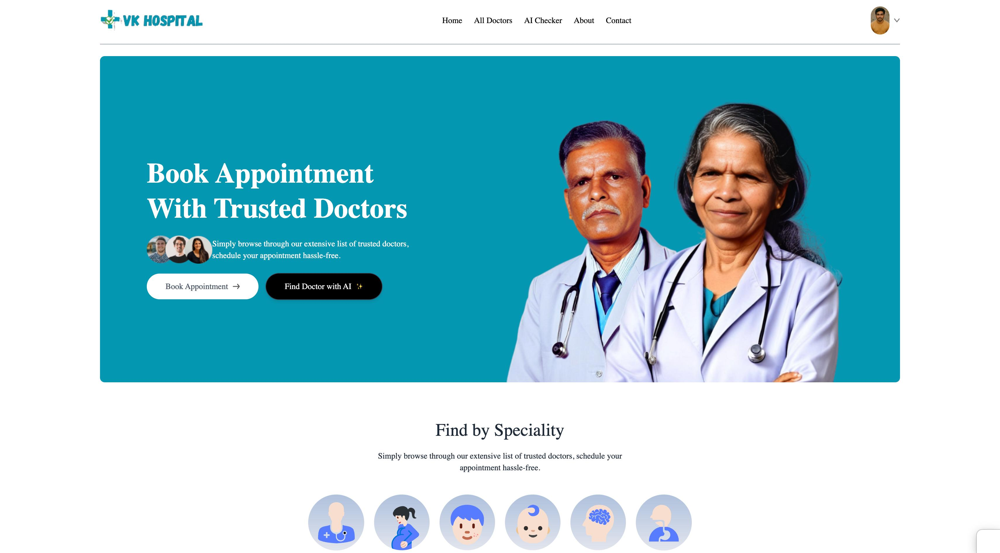
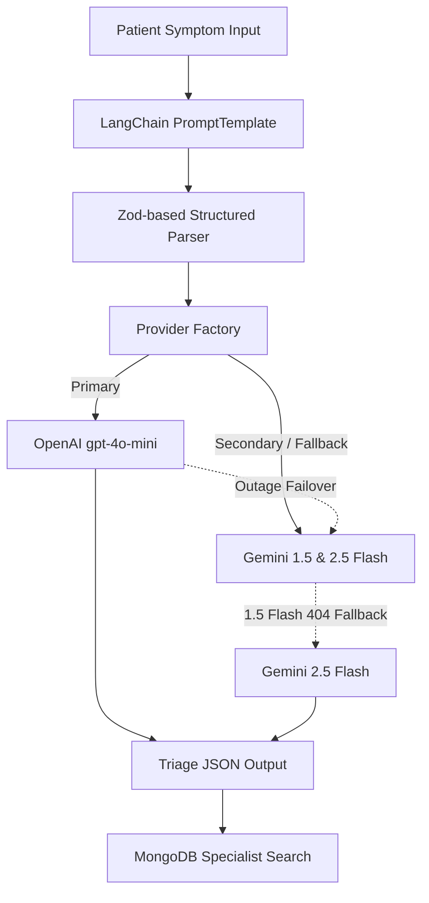

# 🏥 VK Hospital - Premium MERN + LangChain AI Management System

🔗 **Live Link:** [https://hospital.divyanshuvarshney.online/](https://hospital.divyanshuvarshney.online/)



VK Hospital is a comprehensive, production-grade Healthcare Management Platform designed to bridge the gap between patients, doctors, and administrators. It features a fully integrated **AI Symptom Checker & Doctor Recommendation System** powered by a modular, fault-tolerant **LangChain** architecture.

---

## 🚀 Key Features

*   **Patient Portal:** Search doctors by specialty, book slots across a dynamic calendar, manage profiles, cancel appointments, and make online payments.
*   **AI Symptom Checker:** Analyze symptoms using natural language, evaluate severity, view precautions, and automatically get routed to matching, available specialists.
*   **Google Authentication:** Secure one-tap sign-in and sign-up using the official Google Identity Services SDK, with responsive mobile resizing and colliding localhost session automatic recovery.
*   **Admin Operations Dashboard:** High-end BI hub featuring onboarding flows, global booking controls, and custom SVG interactive visualizations (Real-time estimated income, line charts for booking trends, specialty demand analysis, and status breakdowns).
*   **Doctor Panel:** Manage individual appointments, mark consultations as complete, adjust fees/address, and monitor monthly earnings.
*   **Secure Payment Integration:** Online consultation fee payments processed securely via the Razorpay Gateway.
*   **Dynamic Media Storage:** Multi-part file uploads using Multer paired with Cloudinary CDN storage.

---

## 🔑 Test Login Credentials

Use the following credentials to log in and test the Patient Portal:

*   **E-mail / Username:** `test@vkhospital.shop`
*   **Password:** `test1234`

---

## 🧠 AI Checker Architecture

The symptom checker utilizes a decoupled, modern AI stack using **LangChain Expression Language (LCEL)**:



### Resiliency Measures:
1.  **Provider Failover:** Automatically switches from OpenAI to Gemini if keys are invalid or rate-limits are reached.
2.  **Model Fallback:** Within the Gemini pipeline, automatically transitions from `gemini-1.5-flash` to `gemini-2.5-flash` to prevent service downtime.
3.  **Timeout limit:** Limits AI response times to `15 seconds` using `Promise.race()`.

---

## 📊 Operations & Analytics Dashboard

To maximize resume value and platform control, the Admin Dashboard has been upgraded with a **zero-dependency interactive SVG visualization engine**:

*   **Interactive Area Trendline:** Hand-drawn SVG charts with hover state markers. Users can hover over vertices to show tooltips with specific date volumes.
*   **SVG Circular Donut Chart:** A custom SVG calculation showing the exact proportion of completed, cancelled, and pending appointments in real-time.
*   **Department Demand Analysis:** Beautiful CSS progress bars calculating booking frequency per specialty department.
*   **Top Practitioner Leaderboard:** Real-time leaderboard listing the top 3 doctors based on appointment booking frequency.
*   **Estimated Revenue KPI:** Real-time earnings summary based on total booking values.

---

## 📂 Project Structure

```text
VK_HOSPITAL/
├── backend/                  # Express API Server (Node.js)
│     ├── ai/                 # Decoupled LangChain AI Engine
│     ├── config/             # DB & CDN Connections
│     ├── controllers/        # Core Controller Handlers
│     ├── modules/            # Mongoose Schemas & MongoDB Models
│     ├── routes/             # Express API Endpoints
│     └── server.js           # Main Entry Point
│
├── frontend/                 # Patient Client Portal (React + Vite + Tailwind)
│     ├── src/
│     │    ├── components/    # Reusable UI Components
│     │    ├── context/       # App State Context
│     │    └── pages/         # Patient Views (AiChecker, MyProfile, etc.)
│     └── package.json
│
└── admin/                    # Admin & Doctor Management Panel (React + Vite)
      ├── src/
      │    ├── context/       # Dashboard Contexts
      │    └── pages/         # Admin & Doctor workspaces
      └── package.json
```

---

## 🛠 "Installation & Setup
 
### Prerequisites
*   Node.js (v18+)
*   npm (v9+)
*   MongoDB Account (Atlas or Local)
 
### Step 1: Configure Backend Environment
Create a `.env` file inside `/backend` and populate it with your credentials:
```env
MONGODB_URI = 'your_mongodb_connection_string'
CLOUDINARY_NAME = 'your_cloudinary_cloud_name'
CLOUDINARY_API_KEY = 'your_cloudinary_api_key'
CLOUDINARY_SECRET_KEY = 'your_cloudinary_api_secret'
ADMIN_EMAIL='admin@vkhospital.com'
ADMIN_PASSWORD='your_secure_admin_password'
JWT_SECRET='your_jwt_signing_secret'
RAZORPAY_KEY_ID='your_razorpay_key_id'
RAZORPAY_KEY_SECRET='your_razorpay_key_secret'
CURRENCY='INR'
PORT=4000
GOOGLE_CLIENT_ID='your_google_oauth_client_id.apps.googleusercontent.com'

# AI Configuration
AI_PROVIDER='openai' # 'openai' or 'gemini'
OPENAI_API_KEY='your_openai_api_key'
GEMINI_API_KEY='your_gemini_api_key'
```

### Step 2: Configure Client Portals
Create a `.env` file in the `/frontend` directory:
```env
VITE_BACKEND_URL='http://localhost:4000'
VITE_RAZORPAY_KEY_ID='your_razorpay_key_id'
VITE_GOOGLE_CLIENT_ID='your_google_oauth_client_id.apps.googleusercontent.com'
```

Create a `.env` file in the `/admin` directory:
```env
VITE_BACKEND_URL='http://localhost:4000'
```

---

## 🚀 Running the Project Locally

Open three separate terminal sessions to boot all services:

### 1. Boot Backend Server
```bash
cd backend
npm install
npm run server
```

### 2. Boot Patient Portal
```bash
cd frontend
npm install
npm run dev
```

### 3. Boot Admin & Doctor Dashboard
```bash
cd admin
npm install
npm run dev
```

---

## 🌐 Deploying to Render
1.  **Backend:** Configure the root directory to `backend`, set the build command to `npm install`, and set the start command to `npm start`.
2.  **Environment Variables:** Make sure all credentials in the `.env` list (including `OPENAI_API_KEY` and `GEMINI_API_KEY`) are entered in Render's environment settings.
